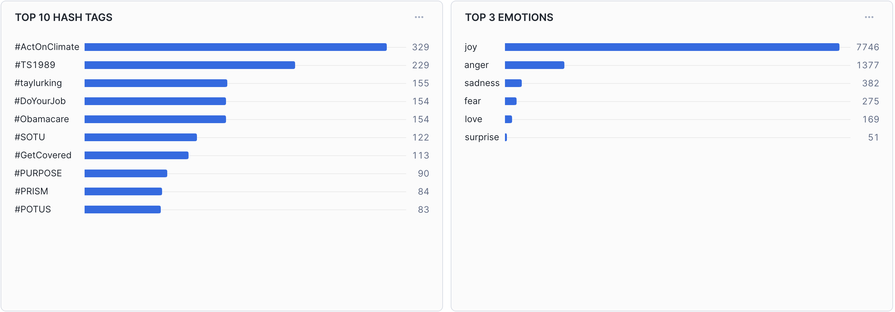
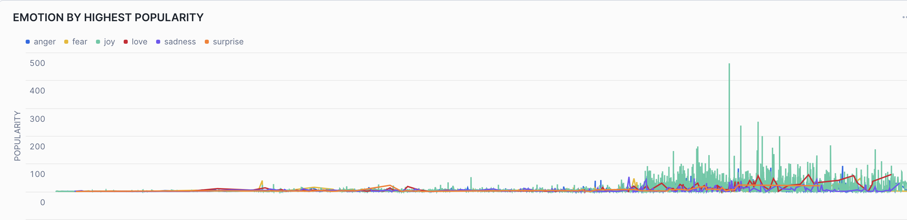

# 🐦 Tweet Popularity Predictor

A comprehensive **machine‑learning pipeline** that performs three distinct tasks on social‑media data:

1. **Emotion classification**  
2. **Hashtag generation**  
3. **Popularity scoring** (0 – 100)

> A small helper script (`codes/scripts/load_to_snowflake.py`) shows how predictions might be loaded into Snowflake, but the **core package does not depend on any data‑warehouse**.

Ships as both a one‑liner **CLI** and a clean **Python API**.

---

## 📁 Folder map

```
src/tpp/                 # installable package
│   ├── tasks/           # emotion.py, hashtags.py, popularity.py
│   ├── model.py         # MTMLModel facade
│   └── cli.py           # command‑line entry point
data/                    # sample CSVs
results/                 # dashboards, predictions
codes/scripts/           # optional utilities (e.g. Snowflake loader)
tests/                   # pytest scaffold
docs/                    # design notes / notebooks
```
---

## 📈 Dashboards (Snowflake)

> These screenshots were produced after loading predictions to **Snowflake** and building dashboards.  





---

## ⚡️ Quick start

### 1 · Install

```bash
# inside a fresh virtualenv / conda env
pip install -r requirements.txt
pip install -e .         
```

### 2 · Single‑tweet prediction (CLI)

```bash
# if the console‑script was installed
tpp --content "Transformers are amazing!" \
    --number_of_likes 42 --number_of_shares 7 \
    --task all

# otherwise call the module directly
python -m tpp.cli --content "Transformers are amazing!" \
    --number_of_likes 42 --number_of_shares 7 \
    --task all
```

This will  
🎭 **classify emotion** 🏷️ **generate hashtags** 📈 **score popularity**.

**Run individual tasks**

```bash
tpp --content "Great day!" --task emotion      # emotion only
tpp --content "Great day!" --task hashtags     # hashtags only
tpp --content "Great day!" --task popularity   # popularity only
```

(Default likes/shares are 0 if omitted.)

### 3 · Batch CSV

```bash
tpp --file data/tweets.csv --task all
# ➜ writes final_result.csv in the current working directory
```

### 4 · Python API

```python
import pandas as pd
from tpp.model import MTMLModel

df = pd.read_csv("data/tweets.csv")
model = MTMLModel()

df = model.predict_popularity(
         model.predict_hashtags(
           model.predict_emotion(df)))
print(df.head())
```

---

## 🛠️ Technical details

| Task | Model | Notes |
|------|-------|-------|
| Emotion classification | `bhadresh-savani/distilbert-base-uncased-emotion` | Label set: *sadness, joy, love, anger, fear, surprise* |
| Hashtag generation | `gpt2` | Prompted text generation + regex extraction |
| Popularity prediction | `distilbert-base-uncased` embeddings → `LinearRegression` | Scaled to 0 – 100 |

### Input columns

| Column | Type | Description |
|--------|------|-------------|
| `content` | str | Tweet/post text |
| `number_of_shares` | int | Times shared / retweeted |
| `number_of_likes` | int | Likes / favourites |

### Output columns

`Emotion`, `Hashtags`, `hashtags_final`, `popularity`, `content_length`, `hashtags_count`

---

## 🏗 Training / updating the popularity regressor

```bash
tpp --file data/historical_tweets.csv --task popularity
# trains a fresh regressor, saves popularity_model.pkl, then predicts
```

The call above **re‑trains every time**, which can be slow.  
For fast inference later:

```python
from tpp.model import MTMLModel
model = MTMLModel()
model.load_popularity_model()          # loads saved regressor
df_out = model.predict_popularity(df_new)
```

---

## 🎯 CLI arguments

| Argument | Type | Description | Required |
|----------|------|-------------|----------|
| `--file` | str | Path to CSV with tweets | Either `--file` **or** `--content` |
| `--content` | str | Single tweet text | ″ |
| `--number_of_shares` | int | Shares / retweets (default 0) | No |
| `--number_of_likes` | int | Likes / favourites (default 0) | No |
| `--task` | str | `emotion`, `hashtags`, `popularity`, `all` | **Yes** |

---

## 🔧 System requirements

| Resource | Minimum | Recommended |
|----------|---------|-------------|
| Python | 3.8 | 3.10+ |
| RAM | 4 GB (CPU) | 8 GB+ |
| GPU | optional | CUDA‑capable for faster inference |
| Disk | ≈ 1 GB | — |

`cli.py` caps batch size at **10 000 rows** (`nrows=10_000`).

---

## 🐛 Troubleshooting

| Issue | Fix |
|-------|-----|
| CUDA / GPU errors | Install the PyTorch build matching your CUDA version |
| OOM / memory errors | Split the CSV or process with `--task emotion` then `--task popularity` separately |
| Slow inference | Use a GPU or reduce batch size |
| Model download stalls | Check internet and Hugging Face availability |

---

## ✨ Roadmap

- [ ] Batch BERT embeddings & emotion inference for speed  
- [ ] Replace GPT‑2 with instruction‑tuned hashtag model  
- [ ] Unit tests + CI  
- [ ] FastAPI micro‑service & Dockerfile  

---

*Made with ❤️ & DistilBERT — PRs welcome!*


